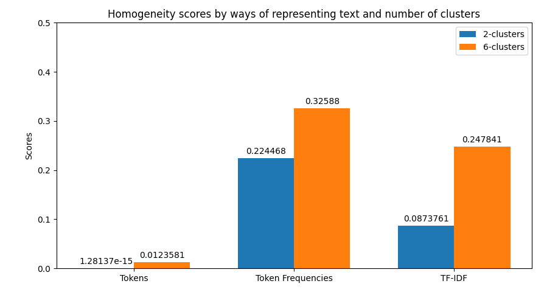
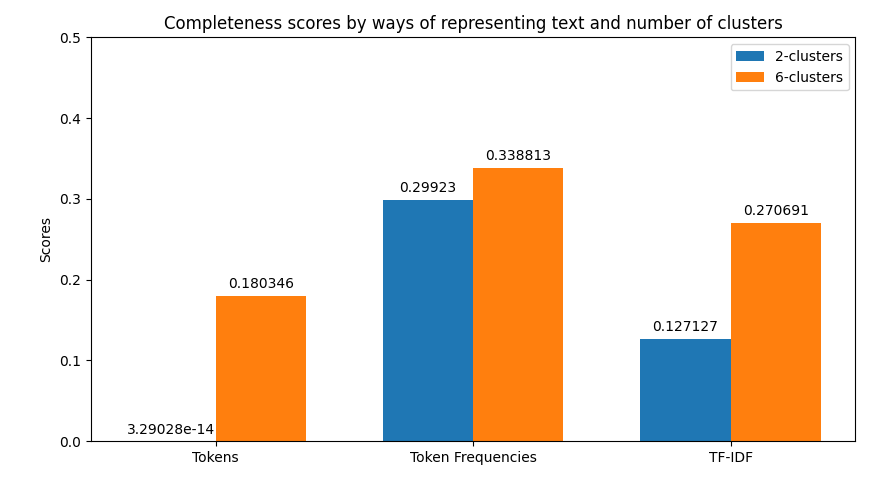
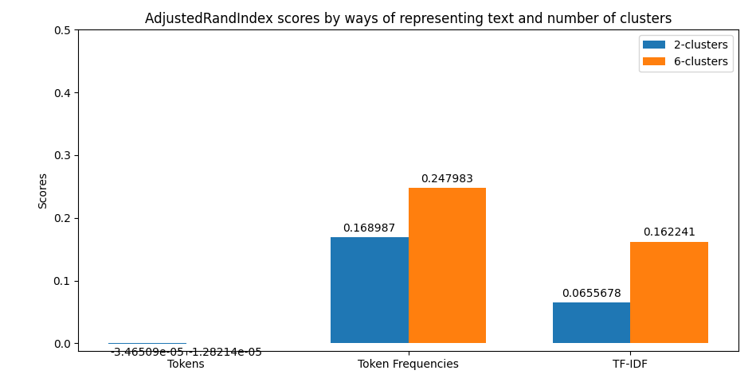
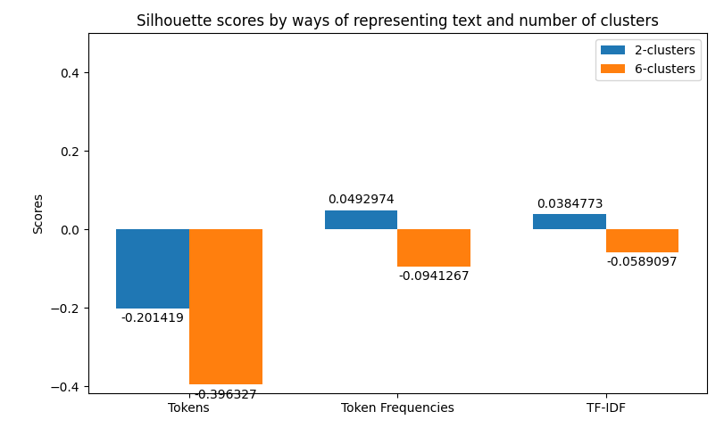
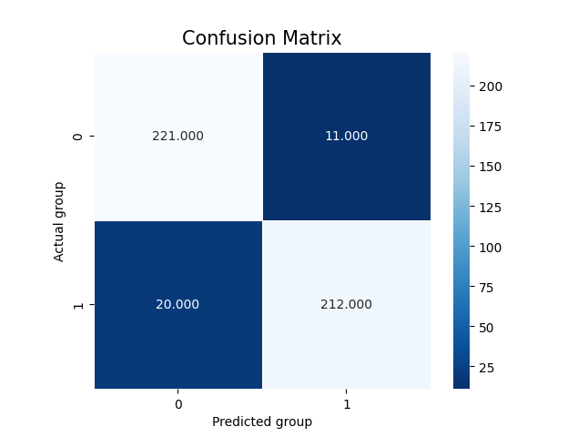
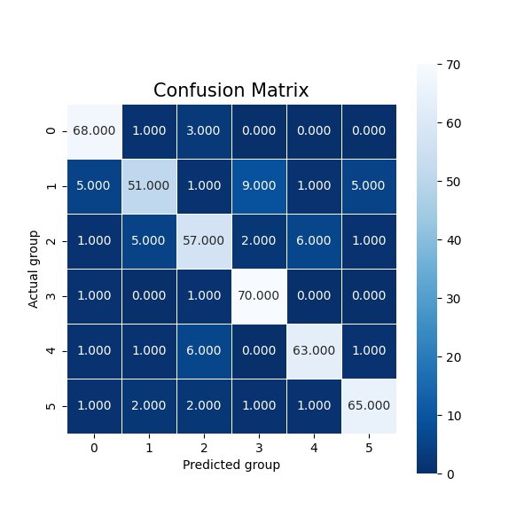
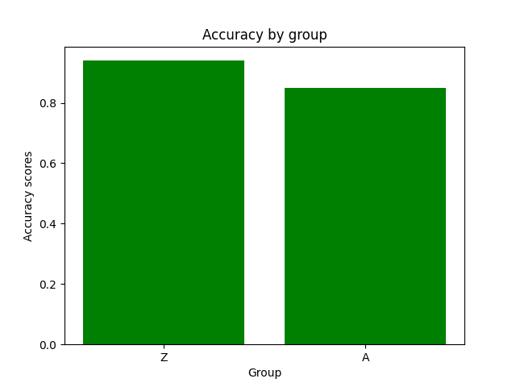
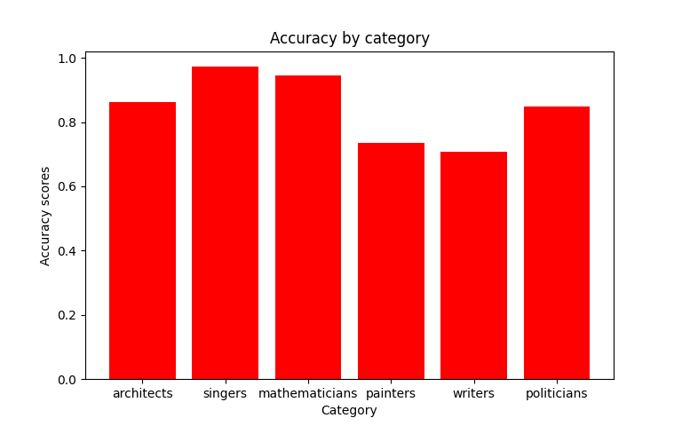

# Clustering and Classifying People based on Text and Knowledge Base information

## General overview
The project constitutes of two main subprojects (reflected in the subparsers), namely:
1. `Corpus` extraction and text normalization,
2. Preprocessing, `Clustering & Classification`; along with the evaluations of the models and respective visualizations.

### Corpus
Corpus has been extracted from `wikidata` using `Sparql`. The respective queries provide links to 6 groups of interest - `painters, writers, singers, politicians, architects, mathematicians` wchich constitute 2 bigger clusters - 3 former - `artists`, 3 latter - `non-artists`.

`Wikidata's` API and its `Python's` wrapper - `wptools` take a while to query and process the obtained data; hence the `wiki-clustering` by default caches the normalized results by saving data and its corresponding schema after the extraction. This allows one extract as many corpora as desired; the sizes can be adjusted by specifying respective attributes for the extraction as parameters to the script. By initially preparing several corpora one could later focus solely on investigating different settings and tuning hyper-parameters to find the most promising setup for the task of interest.

Before saving, the data is normalized - tokenization, lowercasing, and filtering out meaningless wordforms (function words) not to polute the data. Since the goal doesn't regard understanding the structure of the data, leaving those tokens out in the corpus would only complicate the learning process. Additionally, we remove all the punctuation.

Initial representation is further processed to extract simple NLP-based features such as extraction of tokens matching certain part of speech in their base form (via lemmatization), and detecting named entities. Based on the outputs, results are being stored as separate attributes respectively. Prefix of the column is left from the original column, whilst the suffix contains the information about what has been extracted / processed. It is up to the user to decide which subset of attributes would be useful for the task of interest. It has been observed that among the simple setups the prominent results can be obtained using just tokenized `content` attribute. This may vary, e.g. depending on the size of corpus.

After the whole process, script creates vocabulary and dictionaries mapping tokens to their corresponding ids and back to their NL representation. The script allows toggling between the two representation back and forth (from textual data to nueric and vice versa). The numerical representation is desired format by any machine learning model; whereas NL-form is better understood by humans. The latter could have been used, for instance, to preview the models' predictions in a human-readable manner.

### Clustering / classification
`Wiki-clustering` implements both clustering and classification. Both methods can be customized in terms of prediction type; we distinguish between `group-level` clustering / classification and - `category-level`. The former one tries to identify data points as `artists vs. non-artists`; whereas the latter one predicts persons' occupation category `painters vs. writers vs. singers vs. politicians vs. architects vs. mathematicians`. For the clustering algorithm we've utilized `scikit learn's` `KMeans`, whereas for the classification task we've implemented a custom `PyTorch` model of a logistic regression with a single hidden and an output layers. After the forward pass results are being passed through a softmax activation layer to obtain predictions' estimates per `group` or `category` depending on the used approach. Weights in the hidden layer are of the `N_MINIBATCH x N_HIDDEN` shape, whereas output layer's are - `N_HIDDEN x N_OUT_CLASSES` resulting in the output of shape `N_MINIBATCH x N_OUT_CLASSES`. This behaviour is desired since we're interested in getting prediction of the class per each data point in the dataset (in this mini-learning case given by a data mini-batch).

In the case of clustering evaluation of the model is given by both intrinsic and extrinsic methods, namely: `Homegoeneity`, `Completeness`, `V Measure`, `Adjusted Rand Index`, and `Silhouette` scores. Each evalution is visualized as a juxtaposition between clusters of size 2 (for `groups`) and 6 (for `categories`) giving a comparison between the two. In the case of classification we're allowed to perform more robust evaluation since we have the golden dataset to measure the predictions against. For this reason we're computing a confussion matrices of each models evaluation (resulting in two figures - one per class setting). Additionally we're computing `precision`, `recall`, `f1 score`, and `accuracy`. The first four ones have been computed in the macro-scale; whereas the last one is simply calculated as the average of accuracies between different classes. `Accuracy` scores have been used as a metric to be visualized but visualizing method is flexible enough to easily be adjusted to visualize other metrics if only accumulated results of testing are stored in the correct format. 

## Installation
Move into the desired location in your local file system and execute the following command:
```bash
$ git clone https://github.com/amillert/wiki-clustering.git
```
Once it's done, all the required files are at your disposal.

The environment.yml file contains all the information to successfully recreate the `anaconda` virtual environment along with the correct python version and all the compatible version of libraries used in the project. In order to build the virtual environment, make sure `anaconda` is availible in your system by typing:
```bash
$ conda --version
```

In case, it's not availible refer to the official manual at https://docs.anaconda.com/anaconda/install/.

If `anaconda` tool is at your disposal, one can proceed and recreate the virtual environment. Simply run the command:
```bash
$ conda env create -f environment.yml
```

The virtual environment's name is `amill_nakaz_2021` and it can be activated by typing:
```bash
$ conda activate amill_nakaz_2021
```

In order to deactivate the `anaconda` virtual environment, one can run the command:
```bash
$ conda deactivate
```

### Using the project
As mentioned before, the main project constitutes two subprojects - `corpus`, and `prediction`. The distinction between the two, and their respective arguments are reflected in the `utils/argparser.py` file. The two differnt subprojects are related to each other but should generally be treated as separate. Each of them comes with a set of parameters guiding the logic of execution and configuration.

#### Corpus subparser

| Id |       Full parameter      | Alternative |                          Functionality                          |
|----|:-------------------------:|:-----------:|:---------------------------------------------------------------:|
| 1  |      `--num_entries`      |     `-n`    | Specifies the amount of persons  to be extracted per occupation |
| 2  | `--sentences_per_article` |     `-k`    | Specifies the amount of sentences to be extracted per entry     |
| 3  |        `--parallel`       |     `-p`    | Flag which specify whether extraction should be run in parallel |
| 4  |       `--save_path`       |     `-s`    | Specifies a path to save the corpus                             |

Nota bene:
1. If there are not enough sentences per entry, it's being discarted.
2. The level of parallelization (without enforcing some messaging mechanism between actors) is limited by the fact that we need to extract `--num_entires` per category. Additionally we don't have a set of persons at our disposition beforehand since it's being extracted at the runtime as well so we can't create a pool of threads which continuously take new jobs after they're done with executing a small subtask. Because of all that, we decided to parallelize the job of extracting, filtering, collecting, and processing simply per each category. So in the most busy time of execution there's only 6 processes running asynchronously.
3. The corpus is being stored as a `*.tsv` file along with the corresponding schema allowing to load data in the correct format (list object cannot be pickled). The output path should be provided as directory; behaviour of providing a path is not tested.

#### Clustering / classification subparser
| Id |    Full parameter   | Alternative |                            Functionality                            |
|----|:-------------------:|:-----------:|:-------------------------------------------------------------------:|
| 1  |    `--saved_path`   |     `-s`    | Specifies the path to saved corpus (to load)                        |
| 2  | `--keep_top_tokens` |     `-k`    | Specifies how many of the top-scored tokens should be kept in TFIDF |
| 3  |    `--batch_size`   |     `-b`    | Specifies the size of mini-batch for classification                 |
| 4  |      `--epochs`     |     `-x`    | Specifies the amount of epochs for classification                   |
| 5  |       `--eta`       |     `-t`    | Specifies the learning rate for classification                      |
| 6  |     `--n_hidden`    |     `-h`    | Specifies the size of hidden layer for classification               |

Nota bene:
1. `--saved_path` parameter can take either directory path of the exact corpus `*.tsv` file's path. In case of the former, it will take the most recent file (actually the file with the highest number as a suffix; which in a default behaviour of automatic saving by providing a directory will generate files with incremental suffix number). The corresponding schema's path will automatically be generated. Of course if the path to the specific existing file will be provided, this file will be extracted instead.
2. TFIDF in clustering is performed per each attribute; the results are later combined by stacking the sparse arrays back together.
3. Parameters `--batch_size`, `--epochs`, `--eta`, `--n_hidden` specify respective hyperparameters for classification; names should be self-explanatory.

### Running the script and results
We will start of by activating a `conda` environment:
```bash
$ conda activate amill_nakaz_2021
```

Once, it's done we can run the script; we're interested in obtaining the corpus consisting of 30 persons per category with 10 sentences of content per each entry. We specify parallelization flag:
```bash
python main.py corpus -n 30 -k 10 -s data/raw-corpus -p
```

The resulting files will be located under `wiki-clustering/data/raw-corpus/` as `corpus_0.tsv` and `schema_0.json`. The files' structure can be previewed in the following listings. First regards the corpus file:
```txt
title	description	content	category	group
Claude_Monet	['french', 'impressionist', 'painter', ...]	painters	A
Diego_Velázquez	['spanish', 'painter', ...]	painters	A
```

The second is its schema:
```json
{
  "title": "str",
  "description": "list",
  "content": "list",
  "category": "str",
  "group": "str"
}
```

Having corpus ready, we can move on to clustering and classification. We can run both by choosing the second subparser with the following parameters:
```bash
python main.py prediction -b 16 -x 10 -t 0.8 -k 0.35 -s data/raw-corpus -d 10
```

The first thing provided to the user is a visualization of the metrics retrieved from clustering. Their examples can be previewed below.







In later part of the execution - classification, we will obtain visualization of the confusion matrices:




Which are shortly followed by the juxtaposition of averaged accuracies obtained for each class (whether it's a group or category as previously described).




### Exercises Index 
- Exercise 1-1
    The SPARQL query used to get the names for 6 categories can be found in `utils/__init__.py`.

- Exercise 1-2
